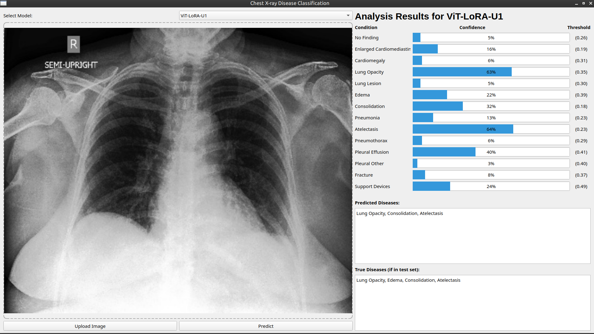

# CHEST X-RAY DISEASES CLASSIFICATION

*[Link to dataset](https://www.kaggle.com/datasets/ashery/chexpert): No need to download the full dataset,images are already available for demonstration via "test" folder

*[Link to checkpoint](https://drive.google.com/drive/folders/19QHupl7XllVxH3yes509_t9xFEXke6mN?usp=sharing): Please download the checkpoint files and place them in the root directory , for example like in the following image:

Files in running order:
1. data_preprocessing.ipynb: For data split and testing augmentations.
2. vit-lora.ipynb and contrastive-vit-unsup.ipynb: One script for normal supervised, the other for contrastive learning, both use "vit_base_patch16_224" model and LoRA adapters.
3. test_model.ipynb: For plotting the mean AUROC graph for model checkpoints and determine classification thresholds for each of the 14 classes in the dataset.
4. create_demo_test.ipynb: For extracting some images from the test set to do demonstration.
5. guiDL.py: To run the interface as shown in the image above.

Inference guide:
1. git clone https://github.com/AddictHUSTler/Project2-ChexpertClassification
2. cd Project2-ChexpertClassification (After this a Python virtual environment should be created instead of running on global Python, as it may cause incompatibility issues)
3. pip install -r requirements.txt
4. python infer.py --model_name ViT-LoRA-U0 --image_path C:/Users/Administrator/Project2-ChexpertClassification/test/u0/chexpert/train/patient00006/study1/view1_frontal.jpg (This is an example, you can change to another image direcotry and model)
5. python guiDL.py (In case of running GUI)
*NOTE: In case you pick a model and image not having the same label modification (for example Vit-LoRA-U0.pth and any image from /test/u1 directory), for both infer.py and guiDL.py file, the prediction still happens but there will be a warning when trying to compare to the true label, since the csv files are put in seperate u0 and u1 directories, hence the choice of model and input image must match) 

